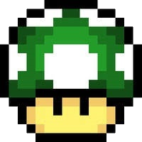

class: title

# 5Minds Coding Dojo

---

class: content

# Agenda

* Vorstellung

* das Thema

* die Aufgabe

---

class: content

# Wer ist heute Euer Host?


* Marc Biegota

* Seit April 2016 bei 5Minds

* Senior Software Architekt und leidenschaftlicher Entwickler

* marc.biegota@5minds.de

---

class: content

# Wer ist heute Euer Host?



* Julian Jarminowski

* Seit Juli 2016 bei 5Minds

* Azubi und Student als Fachinformatiker Anwendungsentwicklung/Bachelor Software- und Systemtechnik

* julian.jarminowski@5minds.de

---
class: content

## Was ist ein Coding Dojo? 

Wikipedia:
* Ein Dojo bezeichnet einen Trainingsraum für verschiedene japanische Kampfkünste. 

* Im übertragenen Sinne steht der Begriff auch für die Gemeinschaft der dort Übenden.

Die Prinzipien der Kampfkünste können und wollen wir uns zunutze machen.
  
---
class: content

## Und warum brauchen wir das?

* Wir sollten unsere Fähigkeiten stets trainieren.

* Wir sollten unsere Gemeinschaft stark halten.

Denn das ist das Fundament unseres Erfolgs!

---
class: content

## Katas

* Der Name stammt aus den japanischen Kampfkünsten und beschreibt grundlegende Übungsformen. 
  * Dabei betont es die Bedeutung von Praxis und Wiederholung für das Lernen.

* Ein Kata bezeichnet in der Programmierung eine kleine, abgeschlossene Übung. 

---
class: content

## Katas
 
* Gibt es für jede Ebene der Softwareentwicklung.
  * Code-, Class-, Application und sogar Architektur-Katas.

* Werden testgetrieben entwickelt.

* Laden dazu ein, auch ausserhalb des Dojo immer wieder neu durchgespielt zu werden.

---
class: content

## Katas - warum immer und immer wieder?

* Grundsätzlich: durch Wiederholung wird effektiv eingeprägt!

* Umsetzung mit einer anderen Programmiersprache.

* Entwicklung unter einem anderen Paradigma
  
  * Prozedural / objektorientiert / funktional / prototypisch

---
class: content

## Katas - warum immer und immer wieder?

* Austausch durch einen anderen Algorithmus mit unterschiedlichen Schwerpunkten.
  
  * kurzer Code
  
  * schnelle Ausführung
  
  * effizienter Speicherverbrauch
  
  * rekursiv statt iterativ oder umgekehrt

---
class: content

## Der Ablauf - Vorstellung der Katas (15 Minuten)

* Pro Dojo können ein oder auch mehrere Katas vorgestellt werden.

* Aber nur ein Kata wird im Dojo bearbeitet.

* Dazu werden die Katas kurz vorgestellt und ggf. das Ziel beschrieben.

* Dann wird kurz über das zu lösende Kata abgestimmt.

* Teambildung (1 bis 3 Personen).
  
---
class: content

## Der Ablauf - Umsetzungsphase (1 Std.)

* Die Teams verteilen sich und setzen das Kata um.

* Die Wahl der Sprache liegt bei den Teams.

---

class: content

## Der Ablauf - Auswertungsphase (1 Std.)

* Die Teams stellen ihre Lösungen vor
  
  * maximal 15 Minuten incl. Diskussion
  
  * Ist die Gruppe zu groß, wird vorher kurz entschieden welche Lösungen gezeigt werden.

---

class: content

# Analyse einer Abseitssituation

Die Situation ist ein stark verpixeltes Bild von Oben. 

* Das Fußballfeld ist 45 x 60 Meter groß.
* Ein Spieler kann bis zu 3 x 3 Meter Platz einnehmen.
* Jedes Feld, außer die Mittellinie, nimmt 1 Quadratmeter Platz ein.
* Nach 30 Metern befindet sich die Mittellinie. 

---

class: content

# Abseitsregeln

Abseits ist wenn:

* der Spieler der gegnerischen Torlinie näher ist als der Ball und
* sich weniger als zwei gegnerische Spieler, egal ob Torwart oder Feldspieler, 
auf gleicher Höhe mit ihm oder vor ihm befinden und
* er sich in der gegnerischen Spielhälfte befindet.


---

class: content, center

## Das Spielfeld

```
oooooooooooooooooooooooooooooooooooIooooooooooooooooooooooooooooooooooo
oooooooooooooooooooooooooooooooooooIooooooooooooooooooooooooooooooooooo
oooooooooooooooooooooooooooooooooooIooooooooooooooooooooooooooooooooooo
oooooooooooooooooooooooooooooooooooIooooooooooooooooooooooooooooooooooo
IooooooooooooooooooooooooooooooooooIooooooooooooooooooooooooooooooooooI
IooooooooooooooooooooooooooooooooooIooooooooooooooooooooooooooooooooooI
IooooooooooooooooooooooooooooooooooIooooooooooooooooooooooooooooooooooI
IooooooooooooooooooooooooooooooooooIooooooooooooooooooooooooooooooooooI
oooooooooooooooooooooooooooooooooooIooooooooooooooooooooooooooooooooooo
oooooooooooooooooooooooooooooooooooIooooooooooooooooooooooooooooooooooo
oooooooooooooooooooooooooooooooooooIooooooooooooooooooooooooooooooooooo
oooooooooooooooooooooooooooooooooooIooooooooooooooooooooooooooooooooooo
```

---

class: content, center

## Die Spielertypen

```
oxo    ooo    +oo    o+o    +++
oxo    oxo    ++o    ++@    +++
oox    ooo    o++    oo+    +++
```

Verteidiger - Angreifer (mit Ball)

???
verteidiger, min. verteidiger, angreifer, angreifer mit ball, max angreifer


---

class: content, center

## Positionierung

Zwischen zwei Teammitgliedern ist immer ein Feld Platz. 

Mit `-` zur Anschauung verbildlicht:

```
oo-----oooooooooooo
oo-oxo-----oooooooo
oo-xxo-oox-oooooooo
oo-ooo-xxo-oooooooo
oo-----oxo-oooooooo
oooooo-----oooooooo
``` 

---

class: content, center

## Zweikampf

Spieler von zwei Mannschaften können auch ineinander dargestellt werden. 

Ein Zweikampf um den geflankten Ball:

```
ooooo+oooooo
oooox++ooooo
oooooxoooooo
oooooooooooo
```

---

class: content, center

## Zusätzliche Informationen

Jedes Foto beinhaltet zusätzlich einen Vektor, der angibt, in welche Richtung 
der Ball fliegt.

---

class: content, center

# Was ist die Aufgabe?

## Interpretiert 5 Testbilder!

Siehe Handout! 

---

class: content, center

Vielen Dank für eure Aufmerksamkeit! Und:

```
Ludi incipiant
    „Die Spiele mögen beginnen“
```
