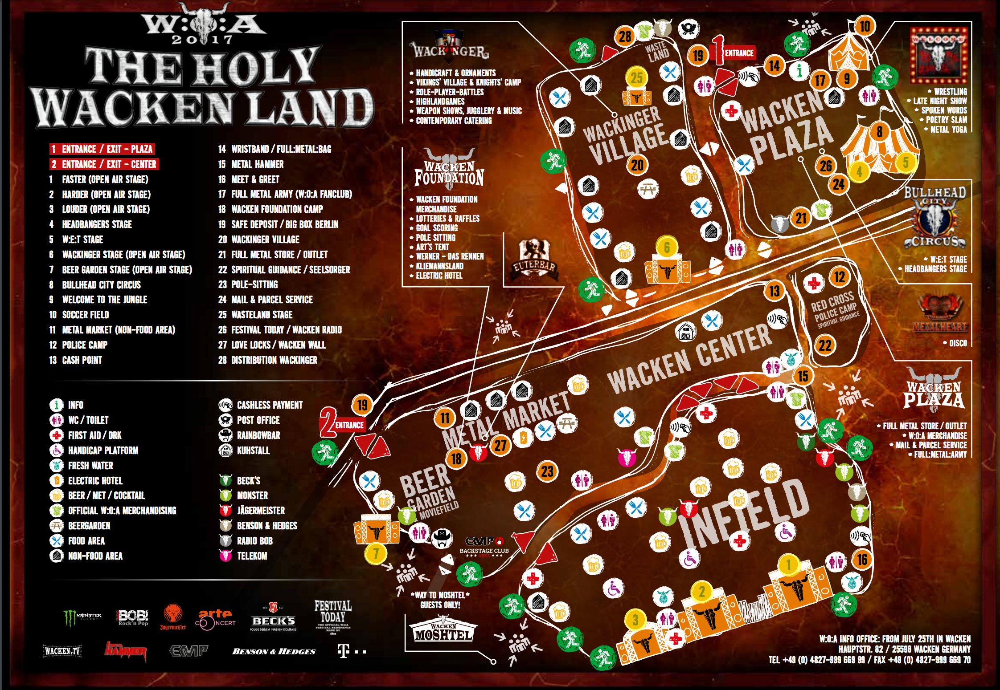

class: title

# 5Minds Coding Dojo

---

class: content

# Agenda

* Vorstellung

* das Thema

* die Aufgabe

---

class: content

# Wer ist heute Euer Host?

* Marc Biegota

* Seit April 2016 bei 5Minds

* Senior Software Architekt und leidenschaftlicher Entwickler

* marc.biegota@5minds.de

---

class: content

# Wer ist heute Euer Host?

* Steffen Knaup

* Seit Oktober 2016 bei 5Minds

* Auszubildender

* steffen.knaup@5minds.de

---

class: content

# Wer ist heute Euer Host?

* Miguel Carballo Garcia 

* Seit Oktober 2016 bei 5Minds

* Auszubildender

* miguel.garcia@5minds.de

---

class: content

## Was ist ein Coding Dojo? 

Wikipedia:
* Ein Dojo bezeichnet einen Trainingsraum für verschiedene japanische Kampfkünste. 

* Im übertragenen Sinne steht der Begriff auch für die Gemeinschaft der dort Übenden.
  
---
class: content

## Und warum brauchen wir das?

* Wir sollten unsere Fähigkeiten stets trainieren.

* Wir sollten unsere Gemeinschaft stark halten.

Denn das ist das Fundament unseres Erfolgs!

---
class: content

## Unsere Aufgaben - weniger Kata, eher Raumschiff Enterprise

* Spaß am Neuen steht im Mittelpunkt
* weniger die Repetition
* keine Formalismen

---
class: content

## Der Ablauf - Vorstellung der Aufgabe(n) (15 Minuten)

* Pro Dojo können ein oder auch mehrere Aufgaben vorgestellt werden.

* Aber nur eine Aufgabe wird im Dojo bearbeitet.

* Dazu werden die Aufgaben kurz vorgestellt und ggf. das Ziel beschrieben.

* Dann wird kurz über das zu lösende Aufgabe abgestimmt.

* Teambildung (1 bis 3 Personen).
  
---
class: content

## Der Ablauf - Umsetzungsphase (1 Std.)

* Die Teams verteilen sich und setzen die Aufgabe um.

* Die Wahl der Sprache liegt bei den Teams.

---

class: content

## Der Ablauf - Auswertungsphase (1 Std.)

* Die Teams stellen ihre Lösungen vor
  
  * maximal 15 Minuten incl. Diskussion
  
  * Ist die Gruppe zu groß, wird vorher kurz entschieden welche Lösungen gezeigt werden.

---

class: content

# Die Karte

---
class: content

# Der Auftrag

Wir wurden beauftragt ein Programm zu erstellen, welches eine Route findet, mit welcher ein Besucher alle Bühnen sehen kann, ohne dabei einen Weg zweimal gehen zu müssen.
Der Haken an der Sache ist allerdings, dass man jeden Weg benutzen muss.

* Sprint 0: PoC - Routenerstellung anhand eines Graphen

---

class: content, center

# Was ist die Aufgabe?

## Überprüft 5 Situationen!

Die 5 Situationen können im [sitations](https://github.com/5minds/5Minds.CodingDojo/tree/develop/katas/2017-09-27_wacken/sitations) Ordner gefunden werden! 

---

class: content, center

## Zusätzliche Informationen

Link: 
https://github.com/5minds/5Minds.CodingDojo/tree/develop/katas/2017-09-27_wacken

---
class: content, center

Vielen Dank für eure Aufmerksamkeit!
