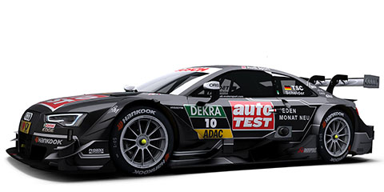
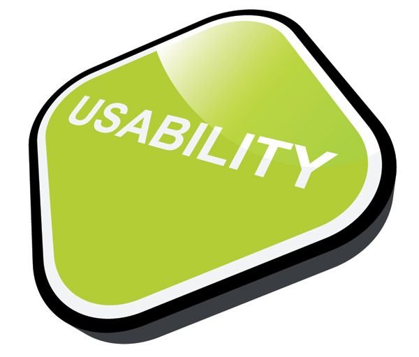

class: title

# 5Minds Coding Dojo
## Ich seh den Wald vor lauter Bäumen nicht...
---

class: content

# Agenda

* Vorstellung

* Thema

* die Theorie

* das Problem

* die Aufgabe

---

class: content

# Wer ist heute Euer Host?


* Marc Biegota

* Seit April 2016 bei 5Minds

* Senior Softwarearchitekt, Berater und leidenschaftlicher Entwickler

* marc.biegota@5minds.de

---

class: content, center

# Was ist unser Thema heute?

Heute geht es (ein wenig) in die Theorie einer der wichtigsten und langlebigsten
Komponenten der Softwareentwicklung...  
  
.center[**Relationale Datenbanken**]

---

class: content, center

# Was ist unser Thema heute?


Etwas genauer: wir richten einen vereinfachten Blick auf das Wunderwerk  

.center[**Index**]

???
Na? Warum sind Relationale Datenbanken relational?
---

class: content

# Die Theorie


* im Zentrum der Betrachtung stehen Tabellen (Relation -> formale Grundlage: Mathematik)
* eine Relation besteht aus Attributen und Tupeln
* ein Tupel ist eine konkrete Kombination von Attributwerten (Datensatz)
* falsche Annahme: Verknüpfungen zwischen Tabellen sind die Relationen (ER-Diagramm)
* Verknüpfungen sind auch Teil einer Relation, da sie die Attributemenge vergrößern
---

class: content, center

# Das Problem

Wie finden wir konkrete Tupel aus einer Vielzahl von Tupeln?  

(in der Praxis haben wir Relationen mit einigen Millionen Tupeln -> Telefonbuch
einer Millionenstadt)

---

class: content, center

# Das Problem (und seine Lösung)

Hierbei hilft uns ein Index (genauer: Suchindex) weiter.  

Über ein gewünschtes Attribut (Nachname im Telefonbuch) lässt sich eine
Sortierung definieren und gesondert speichern.  

Mit einer geeigneten Datenstruktur und einem guten Algorithmus lässt sich dann
das Problem hervorragend lösen!

---

class: content, center

# Das Problem (und seine Lösung)

Im letzten Dojo ist uns eine erste Idee dazu bereits aufgezeigt worden:  
.center[**die Binärsuche**]  

Dabei haben wir auf einem sortierten Array nach einem Element gesucht.  

Eine weitere Datenstruktur ist eine Verallgemeinerung von Listen  
.center[**Bäume**]
---

class: content

# Functional Suitability


Microservices:

* kleine, überschaubare Code-Einheiten mit geringer Komplexität
* schnelle Entwicklung, Wartung oder Tausch durch Fokussierung auf fachliche
  Themen
* technologieunabhängig, daher zukunftssicher
* einzeln verteilbar, denkbar sind eigene Deploymentzyklen
* abhängig nur von Interfaces
* hochgradig skalierbar
* Teamverantwortung für komplette Microservices

---

class: content

# Performance Efficiency



Durch Microservices lassen sich Performance-Engpässe sehr leicht identifizieren
und beheben.

* Load-balancing
* bedarfsgerechte Technologieauswahl
* punktuelle Massnahmen wie Caching, ohne Seiteneffekte zu erzeugen

---

class: content

# Compatibility


Der Blueprint unterstützt dieses Qualitätsziel durch den Einsatz weit
verbreiteter und erprobter Kommunikationskanäle.

* HTTP / REST
* AMQP
* Web-Sockets

---

class: content

# Usability



In Zukunft werden wir verstärkt das Thema Design und Usability im eigentlichen
Sinne adressieren.

---

class: content

# Reliability


* durchgängige Fehlerbehandlung
* redundante Verteilung
* Prozessunterstützung durch Peer-Reviews, Tests und Metriken-Check
* zukünftig umfangreiches Monitoring

---

class: content

# Security


Der Blueprint bietet

* Unterstützung für aktuelle Authentifizierungsmechanismen wie OAuth2
* claims-based Autorisierung über einen IAM-Service
* Datenbank-Sicherheitskonzept (MS SQL Server)

Konkrete Umsetzungen

* Microsoft Identity Servers
* Active Directory Unterstützung
* Kommunikation über HTTPS

---

class: content

# Maintainability


Der Blueprint schafft einen Rahmen, der die Entwickler größtmöglich unterstützt.

* auditierbarer Entwicklungsprozess
* überprüfbare Namenskonventionen und Metriken
* Reduzierung des Code-Umfangs pro Modul (Microservices)
* Zusammenhalt gleicher fachlicher Themen (Kohäsion)
* Minimierung enger Bindungen über z.B. IoC
* horizontale Trennung
* Clean Code

---

class: content

# Portability


Alle gängigen Betriebsysteme werden unterstützt

* Frontends in JavaScript und WPF
* Apps für Android und iOS
* Backends in Node.js und .NET
* Mono und .NET Core-Umsetzungen geplant

---

class: content

# Ausgewählte Themen - Foundation

Bereitstellung von Cross-Cutting-Concerns

* Logging
* Exception Handling
* Validation
* WPF-Shell
* AMQP- und SignalR-Implementierung

---

class: content

# Ausgewählte Themen - AMQP und Notification


* Middleware (hohe Verfügbarkeit durch Cluster)
* komplexes Routing durch Nachrichten
* Nachrichten-Persistenz und - Gültigkeitsdauer

---

class: content

# Ausgewählte Themen - IAM


.tiny-font[
* der Client fordert vom Authentication Provider einen Token an (z.B. mit User /
  Passwort)
* der Authentication Provider prüft die Richtigkeit der Eingaben (z.B. Active
  Directory)
* bei Erfolg schickt der Authentication Provider eine Identity-Referenz (Token)
  zurück
* mit jedem Aufruf des Backends schickt der Client diesen Token weiter
* das Backend fragt geforderte Claims am IAM-Service nach
* der IAM-Service besorgt sich alle Claims der Identity über die sog. Claims
  Source
* schließlich wertet das Backend die Antwort des IAM-Service aus und reagiert
  entsprechend.
]

---

class: content

# Ausgewählte Themen - der Entwicklungsprozess


* Versionsverwaltung mit git flow
* Peer Reviews
* Rechte- und Zugriffskonzept
* Revisionssicherheit
* CI Jenkins-Pipeline
  * Artefakterzeugung
  * Linting
  * Testing
  * Paketmanagement
  * Deployment
  * geplant: automatisches Feature-Branch-Deployment

---

class: content

# Ausblick


* weitere Stärkung des Microservice-Ansatzes
  * Service Discovery
  * livecycle management (health check, preStart, postStop, onChange)
* umfassendes Monitoring auf dem TICK-Stack
* verstärktes Templating
* Usability
* erste Technologie-Reviews (bspw. Configuration)

???
Telegraf

Eine Anwendung zur Prüfung der Auslastung von z.B. CPU, Hauptspeicher,
Festplattenplatz, Datenbank-Parameter für PostgreSQL und MS-SQL. Des Weiteren
kann auch eine Eigenentwicklung angebunden werden.

InfluxDB

Eine Datenbank, welche sich eignet, viele hundertausend Datensätze pro Sekunde
zu verarbeiten.

Chronograph

Eine Anwendung zur Visualisierung der aufgezeichneten Werte als
Zeitreihendiagramm.

Kapacitor

Dient zur Auswertung der Zeitreihen. Mit dieser Anwendung können verschiedene
Parameter in Beziehung gesetzt und Ereignisse aufgrund von Grenzüberschreitungen
(einmalig oder für einen bestimmten Zeitraum) ausgelöst werden.

---

class: content, center

Vielen Dank für Ihre Aufmerksamkeit!

---

class: content

# OMG, we forgot something ...

Slides with Code :)

```CSS
h1, h2, h3 {
  font-family: 'Ubuntu';
  font-weight: normal;
}
.remark-slide-content {
  font-size: 30px;
  vertical-align: middle;
  background-size: 100% 100%;
  background-position: 50% 0.1875px;
}
.remark-slide-content li {
  margin-bottom: .5em;
}
/* Folie: Titel */
.remark-slide-content.title {
  text-align: center;
  background-image: url("media/images/bg0.jpg");
}
```

---

class: content

# OMG, we forgot something else ...

.align-left[
Slides with natural text **and code** :)

* For the left side, simply put <br> `.align-left[ * content here * ]`
* For the right side, simply put <br> `.align-right[ * content here * ]`
* Division is 60/40
]

.align-right[
```CSS
h1, h2, h3 {
  font-family: 'Ubuntu';
  font-weight: normal;
}
.remark-slide-content {
  font-size: 30px;
  vertical-align: middle;
  background-size: 100% 100%;
  background-position: 50% 0.1875px;
}
.remark-slide-content li {
  margin-bottom: .5em;
}
/* Folie: Titel */
.remark-slide-content.title {
  text-align: center;
  background-image: url("media/images/bg0.jpg");
}
```
]

---

class: content

# OMG, we forgot something else entirely ...

.align-left[
Slides with natural text **and code** :)

* For the left side, simply put <br> `.align-left[ * content here * ]`
* For the right side, simply put <br> `.align-right[ * content here * ]`
* Division is 60/40
* **You can actually put anything to the right** (not just code)
]

.align-right[


```CSS
/* Folie: Titel */
.remark-slide-content.title {
  text-align: center;
  background-image: url("images/bg0.jpg");
}
```
]
