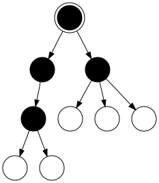
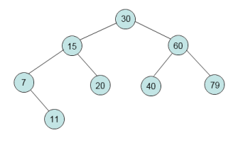

class: title

# 5Minds Coding Dojo
## Ich seh den Wald vor lauter Bäumen nicht...
---

class: content

# Agenda

* Vorstellung

* Thema

* die Theorie

* die Aufgabe

---

class: content

# Wer ist heute Euer Host?

* Marc Biegota

* Seit April 2016 bei 5Minds

* Senior Softwarearchitekt, Berater und leidenschaftlicher Entwickler

* marc.biegota@5minds.de

---

class: content, center

# Was ist unser Thema heute?

Heute geht es (ein wenig) in die Theorie einer der wichtigsten und langlebigsten
Komponenten der Softwareentwicklung...  
  
.center[**Relationale Datenbanken**]

---

class: content, center

# Was ist unser Thema heute?

Etwas genauer: wir richten einen vereinfachten Blick auf das Wunderwerk  

.center[**Index**]

???
Na? Warum sind Relationale Datenbanken relational?
---

class: content

# Die Theorie

* im Zentrum der Betrachtung stehen Tabellen (Relation -> formale Grundlage: Mathematik)
* eine Relation besteht aus Attributen und Tupeln
* ein Tupel ist eine konkrete Kombination von Attributwerten (Datensatz)
* falsche Annahme: Verknüpfungen zwischen Tabellen sind die Relationen (ER-Diagramm)
* Verknüpfungen sind auch Teil einer Relation, da sie die Attributemenge vergrößern
---

class: content, center

# Die Theorie

Wie finden wir konkrete Tupel aus einer Vielzahl von Tupeln?  

(in der Praxis haben wir Relationen mit einigen Millionen Tupeln -> Telefonbuch
einer Millionenstadt)

---

class: content, center

# Die Theorie

Hierbei hilft uns ein Index (genauer: Suchindex) weiter.  

Über ein gewünschtes Attribut (Nachname im Telefonbuch) lässt sich eine
Sortierung definieren und gesondert speichern.  

Mit einer geeigneten Datenstruktur und einem guten Algorithmus lässt sich dann
das Problem hervorragend lösen!

---

class: content, center

# Die Theorie

Im letzten Dojo ist uns eine erste Idee dazu bereits aufgezeigt worden:  
.center[**die Binärsuche**]  

Dabei haben wir auf einem sortierten Array nach einem Element gesucht.  

Eine weitere Datenstruktur ist eine Verallgemeinerung von Listen  
.center[**Bäume**]
---

class: content

# Die Theorie

Baum:

* besteht aus Knoten (Kreise) und Kanten (Linien)
* der Knoten ohne Vater ist die Wurzel
* es gibt nur eine Wurzel
* einen Knoten ohne Kinder nennt man Blatt (weiße Kreise)
* ein Knoten darf beliebig viele Kinder haben
* jeder Knoten (ohne Wurzel) hat genau einen Vater

---

class: content

# Die Theorie

Wir benötigen es aber noch etwas spezifischer:  
.center[**der binäre Suchbaum (BST)**]

* ein BST ist entweder leer, oder
* er besteht aus einer Wurzel mit einem linken und rechten Teilbaum,
* die wiederum BSTs sind
* die Knoten tragen die Schlüsselinformation
* im linken Teilbaum sind alle Schlüssel kleiner als im betrachteten Knoten
* im rechten Teilbaum sind alle Schlüssel größer als im betrachteten Knoten

---

class: content

# Die Theorie

Die Laufzeit beim Suchen ist mit der binären Suche im Array quasi identisch. Wo
ist also der Vorteil des BST?  

In der (DB)-Praxis werden häufig neue Werte hinzugefügt. Das ist auf einem Array
sehr schmerzhaft. In einem BST ist das effizient.

Aber Vorsicht! Ein BST muss "balaciert" werden, sonst degeneriert er!

---

class: content

# Das Problem

* entwickelt eine eigene Datenstruktur, die einen binären Suchbaum speichern
  kann.  
* erfasst den abgebildeten Baum
* implementiert die Suche nach einem bel. Element
* gebt alle Schlüssel mit einem geeigneten Algorithmus (ideal rekursiv) in
  aufsteigender Reihenfolge aus

---

class: content, center

Vielen Dank für Ihre Aufmerksamkeit!