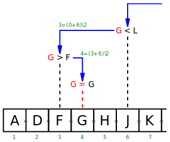

class: center, middle
background-image: url(img/background-intro.png)

# 5Minds Coding Dojo
## Schwerpunkt Rekursion
  
---
class: left, middle
background-image: url(img/background.png)

## Diesmal drei mögliche Probleme

* Berechnung der Fakultät
* Binärsuche auf einem Array
* Türme von Hanoi
  
---
class: left, middle
background-image: url(img/background.png)

## Berechnung der Fakultät

Schreibe eine Funktion, die die Fakultät einer Zahl n zurückgibt.  
Die Funktion ist wie folgt definiert:  
  
n! = 1 für n = 0  
n! = n * (n-1) für n > 0
  
---
class: left, middle
background-image: url(img/background.png)

## Binärsuche auf einem Array

Die binäre Suche ist ein Algorithmus, der auf einem Feld (also meist „in einer
Liste“) sehr effizient ein gesuchtes Element findet bzw. eine zuverlässige
Aussage über das Fehlen dieses Elementes liefert. Voraussetzung ist, dass die
Elemente in dem Feld entsprechend sortiert sind. Der Algorithmus basiert auf
einer einfachen Form des Schemas __Teile und Herrsche__.
  
---
class: left, middle
background-image: url(img/background.png)

## Binärsuche auf einem Array

Zuerst wird das mittlere Element des Felds überprüft. Es kann kleiner, größer
oder gleich dem gesuchten Element sein. Ist es kleiner als das gesuchte Element,
muss das gesuchte Element in der hinteren Hälfte stecken, falls es sich dort
überhaupt befindet. Ist es hingegen größer, muss nur in der vorderen Hälfte
weitergesucht werden. Die jeweils andere Hälfte muss nicht mehr betrachtet
werden. Ist es gleich dem gesuchten Element, ist die Suche beendet.

In der zu untersuchenden Hälfte (und erneut in den folgenden Hälften) wird
genauso verfahren: Das mittlere Element liefert wieder die Entscheidung darüber,
ob und wo weitergesucht werden muss. Die Länge des Suchbereiches wird so von
Schritt zu Schritt halbiert. Spätestens wenn der Suchbereich auf ein einzelnes
Element geschrumpft ist, ist die Suche beendet. Dieses eine Element ist entweder
das gesuchte Element, oder das gesuchte Element kommt nicht vor.

---
class: left, middle
background-image: url(img/background.png)

.center[]

---
class: left, middle
background-image: url(img/background.png)

## Türme von Hanoi (advanced)

Das Spiel besteht aus drei gleich großen Stäben A, B und C, auf die mehrere gelochte Scheiben gelegt werden, alle verschieden groß. Zu Beginn liegen alle Scheiben auf Stab A, der Größe nach geordnet, mit der größten Scheibe unten und der kleinsten oben.  
Ziel des Spiels ist es, den kompletten Scheiben-Stapel von A nach C zu versetzen.  
Bei jedem Zug darf die oberste Scheibe eines beliebigen Stabes auf einen der beiden anderen Stäbe gelegt werden, vorausgesetzt, dort liegt nicht schon eine kleinere Scheibe.  
Folglich sind zu jedem Zeitpunkt des Spieles die Scheiben auf jedem Feld der Größe nach geordnet.

---
class: left, middle
background-image: url(img/background.png)

.center[]  

---
class: center, middle
background-image: url(img/background.png)

## Happy Coding
